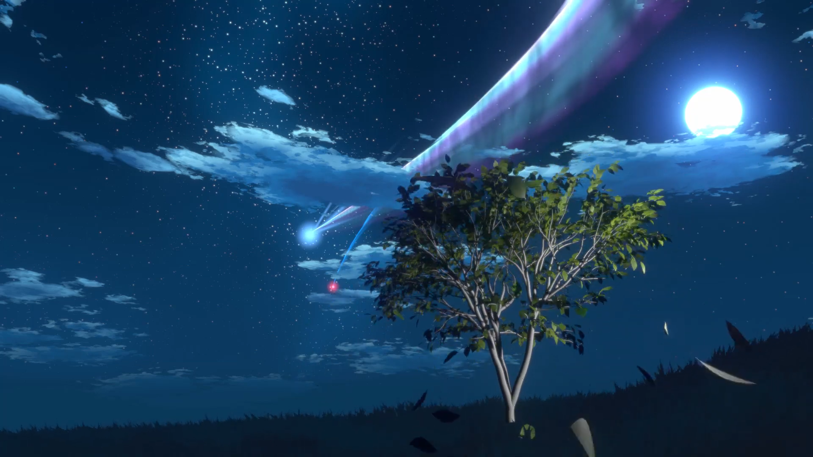

# Blender Leaves Addon

[See the Addon in Action - Recreating a 'Your Name' Scene](https://www.youtube.com/watch?v=KO4YwZF5bn4)

## About the Addon

The Blender Leaves Addon transforms your 3D scenes with the vitality of nature. It's not just an addon; it's a tool for bringing to life varied foliage, dynamic landscapes, and the essence of realism or fantasy in your renders.

**Key Capabilities:**
- **Leaf Generation:** Craft leaves of any shape and form.
- **Landscape Design:** Seamlessly add ground textures, complete with grass.
- **Arboreal Enhancement:** Grow trees in your scene and festoon them with leaves.
- **Physics Customization:** Tailor the movement of your foliage for both animated and static environments.

Ideal for both hobbyists and professionals, this addon offers a suite of tools for environmental detailing in Blender.

## Features

- **Custom Leaves:** Design unique leaves that fit the vision of your scene.
- **Ground and Grass:** Quickly generate realistic or stylized ground cover.
- **Tree and Leaves Synergy:** Integrate leaves with trees, customizing for the perfect look.
- **Physics Tools:** Apply realistic physics for natural movement or set them for a particular style.

## Installation Guide

1. Confirm that you have Blender version 2.8 or newer.
2. Download the addon from this GitHub repository.
3. In Blender, navigate to `Edit > Preferences > Add-ons`.
4. Click `Install...`, then locate and select the downloaded addon file.
5. Activate the addon by checking the box next to its name in the addons list.

You're all set! The addon features are now accessible in the 'N' panel.

## How to Use

With the addon installed, all features are readily available in the 'N' panel:

- Design your leaves under the 'Leaves' section.
- Create your base terrain in the 'Ground' section.
- In the 'Trees' section, combine the trees with your custom leaves.
- Use the Blender properties panel to apply specific physics settings to your foliage.

**Enjoy crafting your own verdant worlds!**
